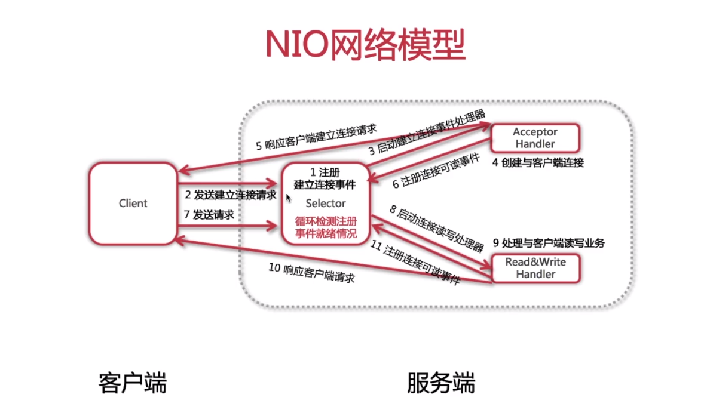
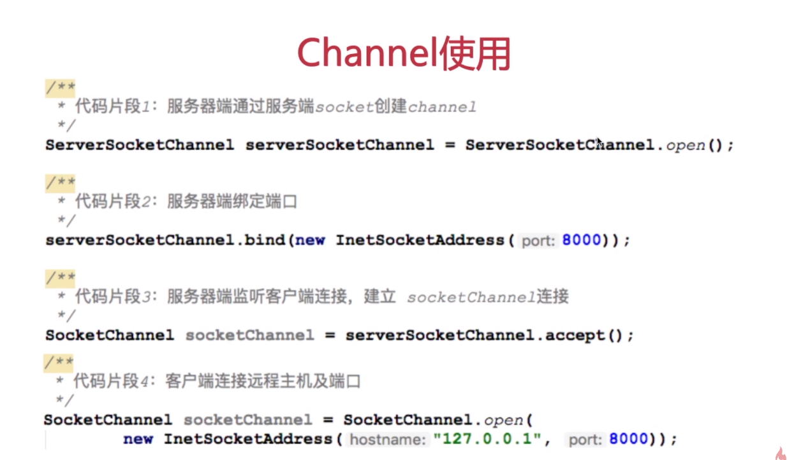
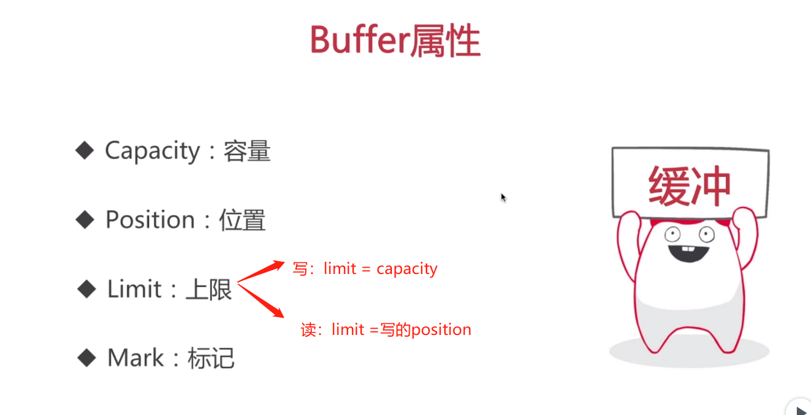
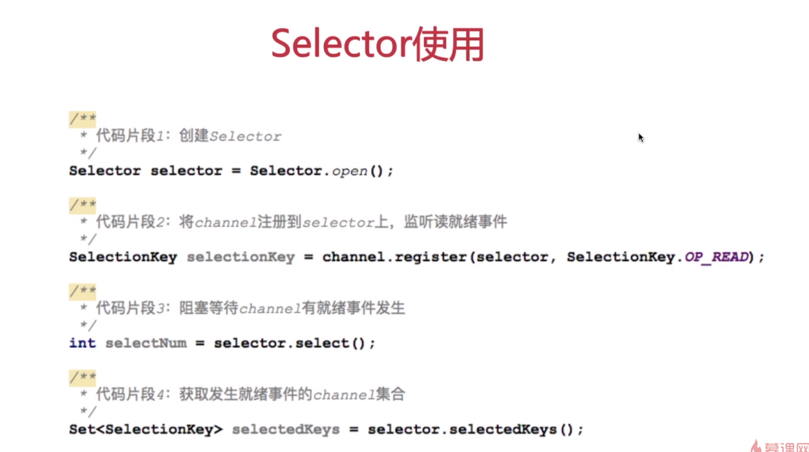
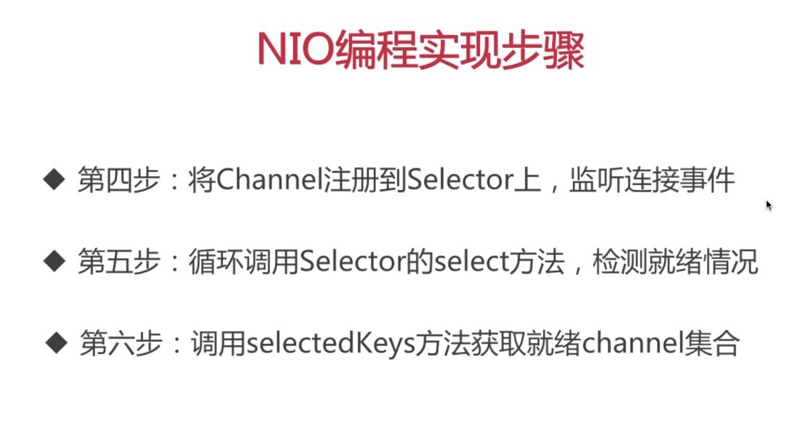
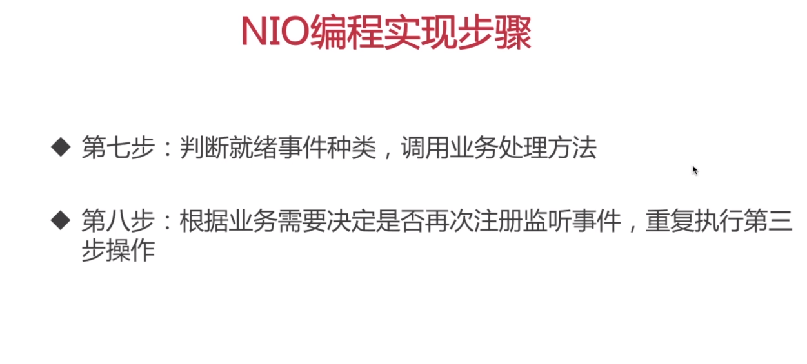
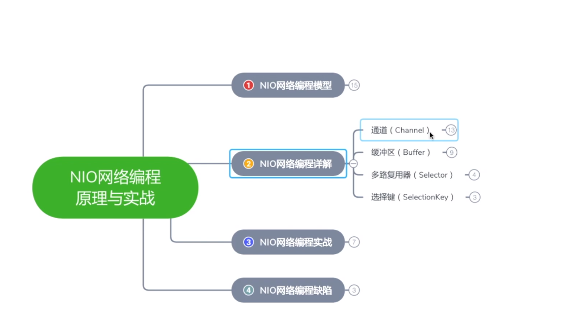
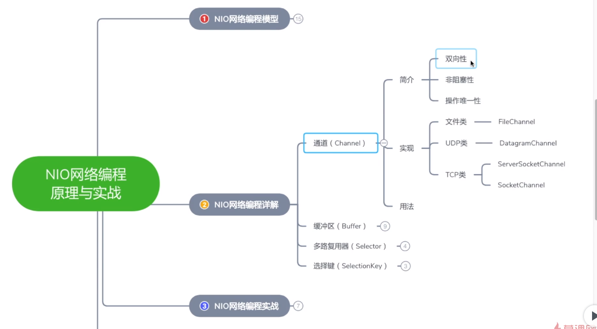
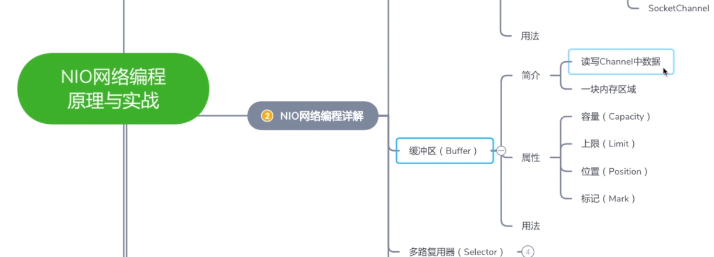

### NIO 网络模型 1：n (非阻塞I/O+Selector) 【单线程的】 

##### 一个线程来处理客户端链接
##### 调用两个handler方法来处理链接的创建/读写业务的处理
##### 与BIO的区别：不需要客户端再发送读写请求 减少了服务器性能的消耗
  
#### 核心
##### Channel&nbsp;&nbsp;:&nbsp;通道
##### Buffer&nbsp;&nbsp;&nbsp;&nbsp;&nbsp;:&nbsp;缓冲区
##### Selector&nbsp;:&nbsp;选择器 或 多路复用器
[介绍链接](https://www.imooc.com/video/19330)
  
* NIO使用Channel

* NIO Buffer介绍

* NIO Selector的使用

  
#### NIO 编程实现步骤

  
#### 总结

