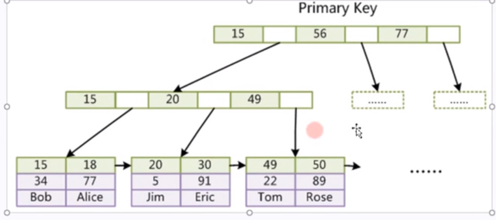

## MySQL 索引
### 大纲

- [为什么MySQL使用的B+Tree而不是使用二叉树/红黑树/B-Tree](#reason)
  - [B+Tree的特点](#bTreeCharacteristics)
  - [B+Tree和hash索引的区别](#bTreeAndHash)
  - [MySQL文件的具体内容及功能](#mySqlFileMean)

- 为什么MySQL索引使用B-Tree而不是使用二叉树（红黑树）

  - 若使用二叉树，在极端情况下会出现没有增加索引一样

​				若使用红黑树（二叉树的变种）

​				树的深度也有可能会出现非常大的情况（不可控-大数据量存储的时候）

- 但如果使用B-Tree（可以理解成红黑树上再改造了一波-增加横向存储容量）

  

- 但是在MySQL中实际上用的是B+Tree而不是B-Tree

B+Tree的特点

**只有在叶子节点记录数据** B树是所有的节点都有记录数据 具体可以结合MySQL实例分析

**非叶子节点只记录一些关键的索引值** 非叶子节点**不存储data** 可以**增加度**【原因：**减少I/O**（增加了横向容量 降低了高度） 既然高度越低越能减少消耗，为什么树的高度不唯一：会出现数据量太大不能全放到内存中】【mysql 官方底层定义一个节点 16k 根据页决定】

**叶子节点之间还有指针** 用于解决范围查找

- 补充：使用B+Tree和hash的区别

  - B+Tree 在范围查找上有优势

  - hash 可以快速找到某一条数据

  - 索引匹配：

    - B + Tree

      - key(last_name,first_name,age)

        创建一个 last_name,first_name,age 的索引

        索引适合查询的类型：

        1.全值匹配 last_name = "黄" and first_name = "帮景" and age = 23

        2.匹配最左前缀 last_name = "黄"

        3.匹配列前缀 last_name LIKE 'S%'    例如 Smith ，Sim 等

        4.精确匹配某一列并且范围匹配另一列  last_name = "黄" and first_name LIKE '帮%' 

        5.只访问索引查询

        

        限制条件：

        1.不从索引的最左列开始查找 则无法使用索引 例如无法用于查找 first_name = ”帮景“ and age >= 23

        2.不能跳过索引中的列 例如无法用于查询 last_name = "黄" and age = 23

        3.若查询的某一列是范围查询，那么其右边所有列都无法使用索引优化 例如无法用于查询 last_name = "黄" and first_name LIKE '帮%'  and age = 23	此时索引只优化查询了 last_name 和 first_name

    - hash

      - KEY USING HASH(last_name)

        - 运行的原理 传入 "黄" 先计算黄的hash值，并且使用该值寻找对应的记录指针 

          假设 黄 的在索引中查到的Hash值为 8784

          计算出来应该指向第三行的指针

          再去比较第三行的值是否为 黄

        - 限制条件：

          1.只存储了Hash值和指针，不存储字段。所以不能通过索引中的值来避免读取行（但是访问内存中的行的速度是非常快的）

          2.索引中的数据并不是按照索引值顺序排序的，所以不能用于排序

          3.索引不支持部分索引列匹配查找 例如 在（A,B）上建立Hash索引 不能仅通过A来使用该索引

          4.索引只支持等值比较 =，IN()，<=> （<=> 不是 <>），不支持范围查询 例如 age>10

          5.访问Hash的速度非常快，但是如果有Hash冲突的情况的话，就要遍历链表中的所有行指针来逐个比较，最后确定要找的值

          6.如果Hash冲突很高的话，那么维护索引成本就会非常高。所以要选择重复率非常低的列建立Hash索引

      - InnoDB 引擎有一个自适应哈希索引

        即在B+Tree索引之上再建立一个Hash索引

        B+Tree查找的不是实际的键本身而是使用键的Hash值

        WHERE 语句中手动指定使用哈希函数

- MySQL数据文件结尾代表的意思：

  myisam

​	假设 Col1 作为索引

​	.frm		表结构

​	.MYD	  数据

​	.MYI		索引

​	假设要查找 49

​	首先 查询索引 发现是B+Tree 先经过三次磁盘I/O 查询到49对应的物理地址

​	然后再去MYD中查找相应的数据（快速通过文件指针找到数据）

​	Innodb（**必须要有主键**）

​	表数据文件本身就是按照B+Tree组织的一个索引结构文件 就是ibd文件

**补充：聚集索引**

- 聚集索引：将表的索引的值和表的数据聚集存储在一起（比如说innodb）
  指索引项的排序方式和表中数据记录排序方式一致的索引
  也就是说聚集索引的顺序就是数据的物理存储顺序。它会根据聚集索引键的顺序来存储表中的数据，
  即对表的数据按索引键的顺序进行排序，然后重新存储到磁盘上。因为数据在物理存放时只能有一种排列方式，所以一个表只能有一个聚集索引。

- 非聚集索引：表的索引的值和表的数据不存储在一起（MyISAM）

  索引顺序与物理存储顺序不同

**主键索引**

**非主键索引**（辅助索引 通过非主键索引查找主键索引）

1. InnoDB 和 MyISAM

   InnoDB 必须要有主键 如果没有的 MySQL后台也会找一个或新建一个作为主键

   同时 主键推荐使用 整形的自增主键  - （工作中有时候用 UUID 有什么不好的地方）

   为什么用整形：

   - UUID 浪费磁盘存储空间，导致每个节点能存储的数据变少 导致索引树增高-从而增加磁盘I/O次数

   - 因为B+Tree需要比大小找值 整型比较大小比UUID比较大小快（UUID需要转换成ASCII然后再比较）

   为什么用自增：

   - 叶子节点从左到右自增 加入数据时候比较方便 直接再后面加 如果不是自增的话 假设叶子节点已经存满了 需要调节 B+Tree 然后再插入数据。所以自增比较好

2. 联合索引

[学习链接](https://ke.qq.com/course/397307?taid=3342163161518075)